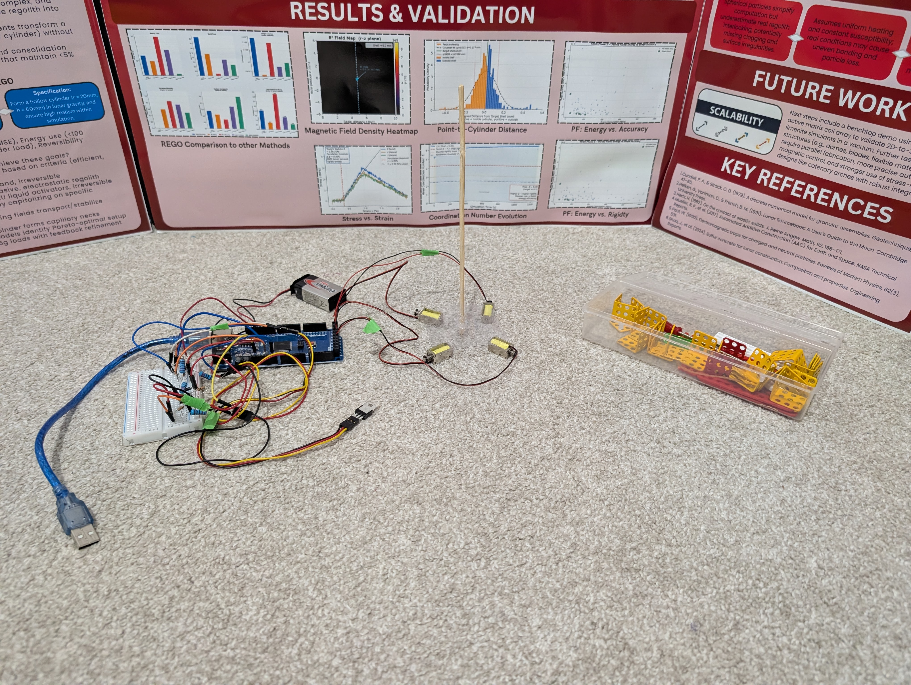

# REGO




REGO simulates autonomous, magnetic-field-driven assembly of lunar regolith particles into a hollow cylinder. The idea: on the Moon or Mars, loose paramagnetic granular material could be shaped into structural components using controlled external magnetic field gradients, with no physical contact or traditional manufacturing.

**Headline concept:** paramagnetic particles seek B² maxima. By shaping external field gradients over time, you control where they go — and, ultimately, what shape they form.

**Publication goal:** an inverse-design framework — given a target geometry, compute the field sequence needed to assemble particles into it.

The full physics model, simulation architecture, and the iteration history behind the current approach are documented in [`simulation/CONTEXT.md`](simulation/CONTEXT.md) and [`simulation/HISTORY.md`](simulation/HISTORY.md) — read those before making changes to the simulation.

## Repository layout

```
REGO/
├── simulation/          # Main Taichi-based particle simulation (the active project)
│   ├── CONTEXT.md       # Full physics/architecture reference — read first
│   ├── HISTORY.md       # Technical evolution log (approaches tried, what failed, why)
│   ├── requirements.txt
│   ├── phase0_baseline.py       # Early prototype
│   ├── phase1_cluster.py        # Phase 1: cluster particles at domain center
│   ├── phase2_shaping.py        # Phase 2–4: transport + cap/wall shaping (main sim)
│   ├── phase3_consolidation.py  # Phase 6: bonding/consolidation
│   ├── phase4_adaptive.py       # Adaptive/general-shape variant
│   ├── analysis/        # Post-processing, metrics, Bayesian-opt sweeps, visualizations
│   ├── data/             # Metrics/state JSON dumps used by the analysis scripts
│   ├── hardware/         # Arduino sketches for the physical solenoid rig
│   ├── outputs/          # Simulation outputs & checkpoints (generated, gitignored)
│   ├── post/             # VTK/VTU output snapshots (generated, gitignored)
│   ├── vendor/           # Vendored third-party libraries (e.g. GeoTaichi; gitignored)
│   └── rego_env/         # Local Python virtual environment (gitignored)
├── tools/                # Exploratory work in commercial/other DEM & FEM packages
│   ├── altair/           # Altair Flux2D / EDEM magnetic-force plugin experiments
│   ├── ansys/            # Ansys Rocky DEM tutorials and workflow files
│   ├── liggghts/         # LIGGGHTS DEM input decks and run logs
│   └── mercurydpm/       # Placeholder — not yet started
├── docs/                 # Project documents (poster, etc.)
├── LICENSE
└── README.md             # You are here
```

`simulation/` is where active development happens. `tools/` holds parallel experiments in commercial/open-source DEM and FEM packages that were evaluated before settling on the custom Taichi simulation (see `simulation/HISTORY.md` for why — short version: none of them support paramagnetic field-gradient forces out of the box).

## Getting started

The simulation requires a GPU-capable Taichi backend (CUDA preferred; falls back to CPU).

```bash
cd simulation
python -m venv rego_env
rego_env\Scripts\activate      # Windows
pip install -r requirements.txt
```

Run the pipeline in order, or resume/skip phases as needed:

```bash
# Phase 1: cluster particles at the domain center
python phase1_cluster.py

# Phase 2-4: transport clusters to targets, then shape caps and walls
python phase2_shaping.py

# Resume an interrupted phase2 run from its last checkpoint
python phase2_shaping.py --resume

# Skip straight to the shaping phase (needs outputs/shape_checkpoint.pkl)
python phase2_shaping.py --skip-to-shape

# Phase 6: consolidate/bond the assembled structure
python phase3_consolidation.py
```

Outputs (VTK/VTU frames, `.pvd` animations for ParaView, and `.pkl` checkpoints) are written to `simulation/outputs/`. Post-processing and analysis scripts (metrics extraction, Bayesian-optimization sweeps, diagnostic plots) live in `simulation/analysis/`.

## Status of other simulation tools

| Tool | Location | Status |
|------|----------|--------|
| Custom Taichi sim | `simulation/` | Active — see `simulation/HISTORY.md` |
| Ansys Rocky | `tools/ansys/` | DEM baseline worked, no magnetic force support |
| LIGGGHTS | `tools/liggghts/` | Compatibility issues; superseded by custom sim |
| Altair (Flux2D/EDEM) | `tools/altair/` | Field solver + custom magnetic-force plugin experiments |
| MercuryDPM | `tools/mercurydpm/` | Not yet started |

## License

MIT — see [LICENSE](LICENSE).
